# Conversation state machine

`greeting → intent → collecting(slots) → confirming → done | escalated`

This is the shape a call's conversation is expected to take. It was drawn
before any state-tracking code existed; **the `confirming → done` edge for
`book_appointment` is now real**, in `app/agent/state.py`
(`DialogState`, `gated_book_appointment`) and `app/agent/store.py`
(Redis-backed persistence, TTL one hour, survives a process restart —
verified live with two genuinely separate processes, not just tests).
`escalated` is real too now (`intent=escalate` on a successful
`escalate_to_human`), and all of it runs on live calls (`app/agent/live.py`).
Everything else on the diagram below — `intent` classification,
`collecting` as its own tracked state with an attempt counter,
`reschedule_appointment` going through the same gate — is still design, not
implementation; see "Open questions," which now doubles as an honest
status list. What's actually enforced today: `book_appointment`'s real,
DB-writing code will not run on a tool call unless a matching call already
happened on a strictly earlier turn (`DialogState.turn_count >
proposed_at_turn`) with identical details — a fact the state machine checks,
not the model's word for it. See `tests/test_state.py` for the gate's own
tests, mutation-tested to confirm they actually catch the gate being
weakened (turn-count check dropped, slot-match check dropped, gate bypassed
entirely) — not just tests that happen to pass.

## Diagram

```mermaid
stateDiagram-v2
    [*] --> greeting

    greeting --> intent : caller speaks

    intent --> collecting : booking / reschedule / availability request
    intent --> done : general question answered (answer_faq)
    intent --> escalated : clinical, or caller asks for a human

    collecting --> collecting : still missing a required field\n(check_availability, follow-up question)
    collecting --> confirming : every field the target tool needs is known
    collecting --> escalated : stuck — too many failed attempts

    confirming --> collecting : caller wants to change a detail
    confirming --> done : caller confirms; book_appointment /\nreschedule_appointment succeeds
    confirming --> escalated : the tool call itself fails\n(e.g. slot taken), or caller asks for a human

    done --> [*]
    escalated --> [*]
```

`escalated` is drawn reachable from **every** post-greeting state, not only
from `confirming` — the system prompt already says so ("Anything clinical
goes to `escalate_to_human`," "anything you can't confidently or safely
handle yourself, or the caller directly asks for a person") and that rule
has no "but only once you've finished collecting" exception. A caller who
says "actually never mind, can I talk to someone" mid-`collecting` should
escalate immediately, not be walked through the rest of the flow first.

## States

| State | Purpose | Tools that may be called | Leaves when |
|---|---|---|---|
| **greeting** | The agent introduces itself. Matches `bot.py`'s existing kickoff ("Please introduce yourself to the user"). | none | The caller says anything |
| **intent** | Classify what the caller wants: book/check availability, reschedule, a general question, or something clinical/needs-a-human. | none directly — `answer_faq` if the whole request is answered in this one turn | The intent is clear |
| **collecting(slots)** | Gather whatever the target tool needs before it can be confirmed: a date/time (via `check_availability`, possibly called more than once as the caller narrows down a day) plus, for a new booking, `caller_name` and `callback_number`; for a reschedule, `appointment_id` and `new_slot`. | `check_availability` | Every required field for the target tool is known |
| **confirming** | Read the specifics back and get an explicit yes *before* calling a mutating tool. This is where `system_prompt`'s "never tell the caller an appointment is booked or moved unless the matching tool call actually returned a successful result" is enforced — the mutating call only happens here, after confirmation, not before. | `book_appointment`, `reschedule_appointment` | Caller confirms and the tool succeeds (→ `done`); the tool call fails (→ `escalated` or back to `collecting` for a new slot, design TBD); caller wants to change a detail (→ `collecting`) |
| **done** | The call's purpose was fulfilled. Terminal for this request. | none | — |
| **escalated** | `escalate_to_human` was called; the caller will get a callback. Terminal. | `escalate_to_human` | — |

## Why `collecting` gets a self-loop and an escalate exit, not just a straight line

This isn't hypothetical caution — it's a direct response to a real,
reproducible finding from live-testing the current, unconstrained loop
(see the conversation history around the five-run "next Tuesday" test):
`claude-haiku-4-5`'s relative-date arithmetic is unreliable, and once it
locks onto a wrong date it tends to **reject correct information that
contradicts its own mistaken belief** rather than converge. Live testing hit
genuine multi-turn loops where the model kept second-guessing the same
date back and forth.

A `collecting` state with an attempt counter — escalate after N failed
attempts to pin down the same field — turns that failure mode from an
unbounded, frustrating loop for a real caller into a bounded one that hands
off to a human. This is the concrete mechanism the diagram is arguing for,
not just a generic "add a safety net" gesture.

## Open questions

- **Multi-intent calls.** Still open. A caller who books an appointment and
  then asks "actually, can you also tell me your hours?" isn't represented —
  does `done` loop back to `intent`, or does the call just end?
- **`confirming` tool failure.** Partially settled, differently than
  originally drawn: a real `ToolError` from a confirmed `book_appointment`
  call (the slot got taken in between) now propagates up through
  `gated_book_appointment` rather than being swallowed — see
  `test_gate_still_raises_tool_error_for_a_genuinely_bad_confirmed_booking`
  in `tests/test_state.py`. Whether the *loop* should catch that and route
  back to `collecting` automatically, versus just telling the caller and
  letting the model decide what to do next (today's behavior, since
  `run_agent_loop` treats it as an ordinary `is_error` tool_result), is still
  open.
- **Where state lives — settled.** `DialogState`, Redis-backed
  (`app/agent/store.py`), keyed by `session_id` (`call_id` once wired into
  the real call path). Not a field on `AgentSession` — that stays in-memory
  and process-local on purpose (see `app/agent/session.py`'s docstring on
  why the raw transcript and the structured slots have deliberately
  different lifetimes).
- **New: `reschedule_appointment` isn't gated.** Only `book_appointment` goes
  through `DialogState`'s confirmation gate. `reschedule_appointment` is a
  second mutating tool with the exact same "never claim success before the
  tool returns it" requirement in the system prompt, and currently relies on
  the model's own restraint for that — the same "prompt hope" this whole
  mechanism exists to replace. Extending the gate to cover it is the most
  direct next step here, not a new idea.
- **New: exact-match confirmation is strict by design, and that's a
  trade-off, not a free lunch.** The gate only treats a call as confirmed if
  its payload is byte-identical to what was proposed. If the model restates
  a field slightly differently between the two calls (a rephrased service
  name, say), the gate correctly refuses to book — but re-triggers a fresh
  read-back instead, which could read as the agent "forgetting" what it just
  confirmed. Given this project's own live-testing found the model
  inconsistent at restating things identically (the "next Tuesday" date-math
  findings), this is a real, not hypothetical, source of possible friction.
- **Settled: wired into the real call path.** `app/agent/live.py` registers
  the tools with the live pipeline's Anthropic service, and every tool call
  goes through the same gate, with DialogState keyed `call:<call_id>`. One
  difference from text mode: `turn_count` is *derived* from the number of
  caller messages in the LLM context, not incremented per inference, because
  Pipecat can run inference several times for one caller message. See
  `docs/notes/live-call-tools.md`.
- **Now real: `escalated`.** A successful `escalate_to_human` sets
  `intent=escalate` and drops any pending booking proposal (`state.py`'s
  `_stateful_escalate`). On a call, it also speaks the handoff line and ends
  the call.
- **Settled: a session's DialogState is inspectable.** `GET
  /agent/sessions/{id}` (`app/routers/agent.py`) returns it raw — dev-only,
  gated on `settings.environment == "development"` (default: disabled,
  fails closed — see `app/config.py`). Useful for exactly the kind of "why
  didn't it book" debugging this document exists to make legible.
- **Settled: the restart test is a real, repeatable pytest test now**, not
  just a one-off manual run. `tests/test_restart.py` spawns two genuinely
  separate OS processes against a real Redis (`tests/_restart_helper.py`);
  it skips itself (not fails) when Redis isn't reachable, so it doesn't
  break the rest of the suite's "no network required" default. Run it with
  `docker compose up -d redis` and, outside Docker,
  `REDIS_URL=redis://localhost:6379/0 pytest tests/test_restart.py -v`.
