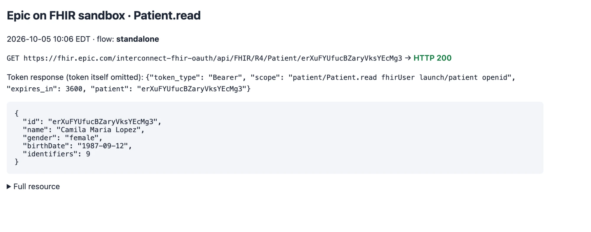
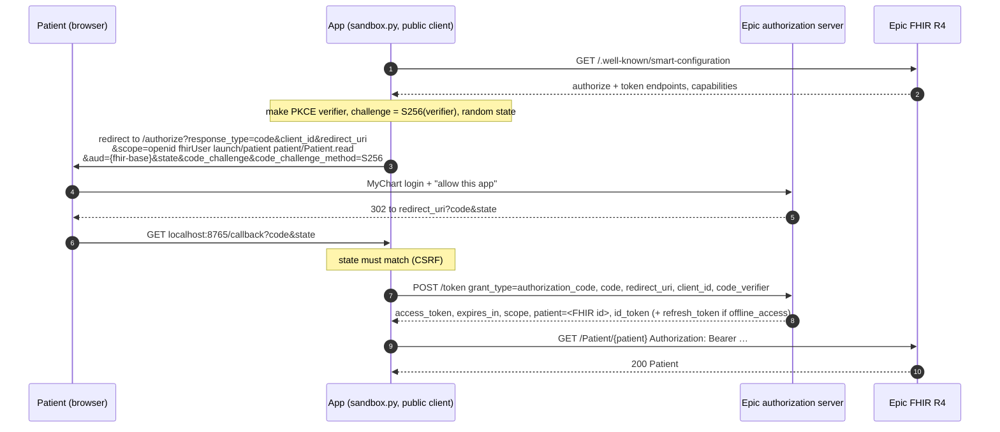
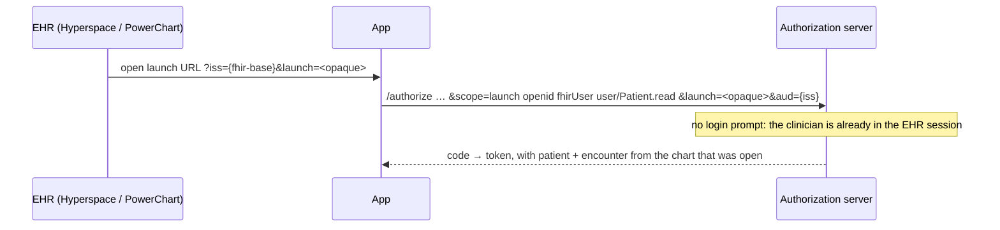
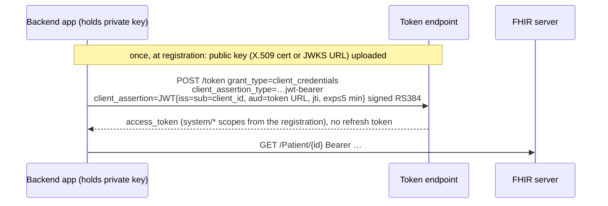

# EHR landscape: vendors, developer programs, auth (lesson 5.5)

Enough to run a discovery call. Researched 2026-10-02. Facts carry a source.
**[3rd-party]** marks a consultancy or blog estimate, not a vendor statement.
Fees and timelines move, so re-check the unverified list at the end before quoting them to a customer.

## The table

| Vendor | Developer program | Auth | What integration takes | Dental applicability |
|---|---|---|---|---|
| **Epic** | **open.epic** (free hub, "750+ no-cost APIs"). **fhir.epic.com** (Epic on FHIR: free self-serve app registration and sandbox). **Vendor Services** (paid: wider API catalog, bigger sandbox, Epic support; ≈$1,900/yr + $500/app [3rd-party]). **Showroom** (marketplace that replaced App Orchard: Connection Hub listing ≈$500/app/yr [3rd-party], Toolbox for recommended practices). | SMART App Launch v1 + v2 (EHR and standalone, public and confidential clients, PKCE S256, refresh tokens). SMART Backend Services (`client_credentials` + `private_key_jwt`). OIDC. All from the sandbox's own discovery document. | Registration gives a non-production and a production client ID, and sandbox sync can take up to 1 hour. Production needs every **customer** to download and activate the app by client ID, behind their security review and IT queue. Patient-facing apps skip most of that. Provider/backend apps: **6–18 months to the first live hospital** [3rd-party], and weeks to months per additional hospital. Bulk FHIR is Group-level only, on customer-built registries, 1 export/group/24 h by default. | **Low.** Epic is hospitals and large groups. A dental practice is on Epic only inside a health system (Epic has a dental module, Wisdom). Relevant when a health-system dental clinic is the customer, or for reading medical history (meds, anticoagulants) before oral surgery. |
| **Oracle Health** (Cerner) | **Code Console** (code-console.cerner.com, CernerCare account). **Open sandbox**, R4 read-only with **no auth**. **Secure sandboxes** for provider/system and for patient. Optional validation via the Open Developer Experience program, then Oracle PartnerNetwork + Healthcare Marketplace. Production validation requires *buying* Millennium environment access (no published price). | SMART App Launch for user apps; SMART Backend Services ("system accounts") for backend. FHIR R4; DSTU2 being retired. | Same shape as Epic: sandbox → validation → per-client enablement. Bulk Groups are patient-ID lists ≤20,000, created by Oracle support. Moving target: the new Oracle Health EHR got ONC certification on 2025-11-18 for US ambulatory. Today's FHIR docs still describe Millennium. | **Low**, for the same reason as Epic: hospital-centric. |
| **athenahealth** | **Developer Portal** + **Marketplace** (no fee for practices to use the Marketplace). Two API families: **Certified APIs** (FHIR R4) and the proprietary **athenaOne** REST APIs (800+ endpoints). | OAuth2. 2-legged `client_credentials` for backend; 3-legged with SMART/PKCE for user apps. Preview (sandbox) at `api.preview.platform.athenahealth.com`, practice **195900**. | Preview credentials are self-serve. Certified-API-only apps can request production. Proprietary APIs, which include **scheduling writes**, need a Platform Services contract or Marketplace partnership, a security review and per-practice authorization [3rd-party]. | **Low–medium.** Ambulatory medical, and the most developer-friendly of the three. Matters for oral surgery or medical-dental groups that run athena. |
| **Open Dental** | Public, fully documented REST API. Developer key on request (vendor.relations@opendental.com, 1–3 business days). Each office issues its own customer key. | `Authorization: ODFHIR {DeveloperKey}/{CustomerKey}`. Not OAuth. **BAA with each office** expected. | Three modes: **Local** (`localhost:30222`, inside each workstation's opendental.exe), **Service** (on the DB server, `:30223`), **Remote** (`api.opendental.com`, relayed to the office through its **eConnector**). Billed per location per month: free read-only throttled to 1 req/5 s; $15 / $30 / $35 tiers for writes (appointments need a paid tier). | **High.** The one major dental PMS you can integrate on your own. The legacy FHIR interface is frozen ("development has stopped"). |
| **Dentrix** (Henry Schein One) | **G-series** (desktop): Dentrix Developer Program, partner-gated. **Ascend** (cloud): **API Exchange** (2023), application + security review. HS One lists 140+ vendors. | Ascend: OAuth 2.0. Vendors need **SOC 2 Type II** and OAuth certification. G-series: local access (ODBC/views/DLL) under the Dentrix API Agreement [3rd-party]. | Form → security review → integration testing → activation, per practice. Fees unpublished; ≈$5k per read/write setup reported for Ascend [3rd-party]. | **High market share, gated access.** In practice, startups reach G-series through an aggregator (below). |
| **Eaglesoft** (Patterson) | **Patterson Innovation Connection** (PIC, 2017): API for "authorized technology partners", Eaglesoft 18+. | Partner credentials; practices can't get their own keys [3rd-party]. | On-prem. ≈$3–5k enrollment + monthly fees [3rd-party]. | **High share, gated.** Aggregator, or PIC if you're big enough. |
| **Curve Dental** (Curve Hero) | Curated partner program (~30 vendors), no public portal or sandbox [3rd-party]. | Partner-issued. | Cloud, so no on-prem agent, but no self-serve access either. | **Medium.** Contact sales, or use an aggregator. |
| **Denticon** (Planet DDS) | **Planet DDS API Program**, open to "any software company" meeting their guidelines. developer.planetdds.com. | OAuth2. Each office enables the integration in Denticon [3rd-party]. | Cloud: webhooks, event-based, sandbox. Writebacks include **online scheduling** and appointment status. 13,000+ practices. | **High** for DSOs (Denticon is the multi-location cloud PMS). Second-best path after Open Dental. |
| **Aggregators**: NexHealth, Sikka, Kolla | One API over many PMSs. **NexHealth Synchronizer**: Dentrix G6.2+, Eaglesoft 18+, Open Dental 17+, Dentrix Enterprise, plus cloud (Ascend, Curve, Denticon, athena…). **Sikka ONE**: 400+ PMSs. | API key → bearer token (NexHealth). Per-partner contracts. | For on-prem PMSs, a Windows service **installed on the practice's DB server** reads and writes the PMS database. Sikka syncs nightly down to 15 min, and **writeback is Enterprise-only**. | **How most dental startups actually ship.** You trade margin and a dependency for not doing N integrations. |

"Screen-level" integration (RPA driving the PMS's desktop UI) exists where
there's no API, reportedly most often for Eaglesoft. The sources are weak.
It's brittle, breaks on every PMS update, and is a fallback, not a plan.

## Epic sandbox: one real Patient.read

`experiments/epic_sandbox/sandbox.py`, offline tests in `experiments/epic_sandbox/tests/`.

```bash
python -m experiments.epic_sandbox.sandbox keys                        # RSA key + X.509 cert to upload
python -m experiments.epic_sandbox.sandbox backend --client-id <id>    # backend services
python -m experiments.epic_sandbox.sandbox standalone --client-id <id> # SMART standalone launch (PKCE)
```

1. Register on fhir.epic.com. Build Apps → Create, with API **Patient.Read (R4)**. Then either:
   - **Backend Systems**: upload `.keys/publickey509.pem` as the non-production key; or
   - **Patients**: redirect URI `http://localhost:8765/callback`.
2. Wait for the non-production client ID to sync ("up to 1 hour").
3. Run it. It does discovery, gets a token, then `GET /Patient/{id}`.
   - Backend reads Camila Lopez (`erXuFYUfucBZaryVksYEcMg3`).
   - Standalone reads whichever patient the token response names.
   - It prints the result and writes `experiments/epic_sandbox/out/patient-read.html` (git-ignored, no token in it) to screenshot.

What's already verified without credentials:
- `GET …/R4/.well-known/smart-configuration` is public. It advertises `launch-ehr`, `launch-standalone`, `client-public`, `client-confidential-asymmetric`, `permission-v1`/`v2`, `permission-offline`, PKCE `S256`, and `private_key_jwt`.
- `GET …/R4/Patient/erXuFYUfucBZaryVksYEcMg3` with no token → **401**.

### Result: 2026-10-05, standalone launch, HTTP 200



`GET …/R4/Patient/erXuFYUfucBZaryVksYEcMg3` → **200**: Camila Maria Lopez, female, born 1987-09-12, 9 identifiers. What the run showed:

- **Context comes from the token, not from us.** We never sent a patient ID. Logging in as the MyChart test patient and clicking Allow made Epic return `"patient": "erXuFYUfucBZaryVksYEcMg3"` in the token response. That is `launch/patient` doing its job.
- **Granted scope = requested scope here**: `patient/Patient.read fhirUser launch/patient openid`. Read it back from the token response; Epic may grant less.
- **`expires_in: 3600`, no refresh token**, because we didn't ask for `offline_access`. After an hour the patient logs in again.
- **Sync delay is real.** The app was saved at about 11:25, and the sandbox recognized the non-production client ID at 11:58. Until then *every* request got the same generic "OAuth2 Error" page, identical to a made-up client ID. Epic gives no "unknown client" message, so you can't tell "not synced" from "misconfigured" except by waiting.
- **The MyChart login is the test patient's, not the developer's.** The fhir.epic.com developer account doesn't log in to MyChart; the sandbox's test patients do.
- **Registration warnings are production-only.** The app works in the sandbox with an `http://localhost` redirect URI and empty Summary/Terms fields. Each of those blocks only "ready for production".

For contrast, Oracle Health's open sandbox answers the same kind of question with **no token**. `GET https://fhir-open.cerner.com/r4/ec2458f2-1e24-41c8-b71b-0e701af7583d/Patient?family=SMART` returned a Bundle with SMART II, Sandy (2020-09-15) and others. That's the difference between a public demo tenant and Epic's "register first" sandbox. Neither is what production looks like.

## Oracle Health and athenahealth, hands-on (2026-10-02)

### Oracle Health: the open sandbox, queried like our scheduler would

Base `https://fhir-open.cerner.com/r4/ec2458f2-1e24-41c8-b71b-0e701af7583d` (the
tenant ID is part of every URL: one Millennium domain = one tenant).

- **`/metadata`**: FHIR 4.0.1, 42 resource types. **Slot, Schedule, Appointment** are all there, the same resources `app/scheduling/fhir.py` uses against HAPI.
- **`Patient/12724066`** → PATCHTEST, NANCY, 1990-01-02. Unauthenticated, read-only.
- **Writes are off.** `POST Appointment` → 404 on the open sandbox. Booking needs the secure sandbox and a registered app.
- **Search rules are stricter than HAPI's**, and an interface built against HAPI breaks on them:
  - `Slot` with only `start=` → *"at least one of _id, service-type, or -pageContext must be provided"*.
  - `Appointment?patient=` → *"at least one of date and -date-or-req-period must be provided"*.
  - `date=ge2020-01-01` → *"date: must have a time"*.
- **Service types are Millennium code sets, not a standard.** Appointments carry `https://fhir.cerner.com/<tenant>/codeSet/14249|4047611` ("Surgery Rapid"); code set 14249 is the appointment type.
- **With a service type it works.** `Slot?service-type=…/codeSet/14249|4047611&start=ge2026-10-05T00:00:00Z&start=lt2026-10-10T00:00:00Z` returned free 30- and 60-minute slots, paged. Slot and Schedule IDs are composites (`4047611-32216049-67387271-1140`: appointment type, location, resource…). They are computed from the scheduling templates, not stored rows like our seeded HAPI Slots.

What that means for a gateway (`OracleScheduleGateway`):
- Service codes must be mapped **per tenant** (our `cleaning` → their code set 14249 value).
- Every search needs a time-qualified window.
- Slot IDs must be treated as opaque and short-lived.

The secure sandbox's `/.well-known/smart-configuration` shows the auth side:
- **Endpoints.** Authorize and token live on `authorization.cerner.com/tenants/<tenant>/…/smart-v1/…`: a **per-tenant** authorization server, and a separate one per persona (provider vs patient).
- **Capabilities.** PKCE `S256`; `authorization_code` + `client_credentials`; `client_secret_basic` + `private_key_jwt`; EHR and standalone launch; SMART v1 and v2.

That is the same SMART surface as Epic. The difference is in the registration step:
- **Oracle:** a Code Console app is usable in the secure sandbox right away.
- **Epic:** a fhir.epic.com app waits up to an hour to sync to the sandbox.

### athenahealth: reading only (preview access needs a registered developer account)

- **Two APIs, one platform.** **Certified APIs** are FHIR R4 (USCDI read/search), self-serve. **athenaOne APIs** are proprietary REST, `/v1/{practiceid}/…`, and that's where scheduling *writes* live: open appointments, book, cancel.
- **Preview environment.** `https://api.preview.platform.athenahealth.com`, shared sandbox practice **195900**, OAuth2 token at `/oauth2/v1/token`. Rate limits are tight (5 token requests/min in preview).
- **Auth.** 2-legged `client_credentials` for a backend, which is what a phone agent would be. 3-legged (SMART, PKCE) for user-facing apps.
- **Going live.** FHIR-only apps can request production credentials. Proprietary APIs, including booking, need a Marketplace partnership or Platform Services contract, a security review, and **each practice enabling the app**. Practices pay no Marketplace fee; partner fees and revenue share aren't public.
- **For us:** athena is the friendliest of the three medical EHRs for a scheduling agent. The proprietary scheduling API is designed for exactly "find open slot → book". It's still a medical (not dental) EHR, so it's relevant only for oral surgery and medical-dental groups.

## SMART on FHIR

SMART is **OAuth 2.0 + OIDC + a FHIR-specific layer**. That layer is
discovery at `{fhir-base}/.well-known/smart-configuration`, scopes named
after FHIR resources, and *launch context*: the token response says which
patient (and encounter) the app is looking at.

### Standalone launch (patient-facing; what `sandbox.py standalone` does)



### EHR launch (clinician-facing): only the start differs



### Backend services (no user; what `sandbox.py backend` does)



### The parts that come up in interviews

- **EHR vs standalone launch.** Who starts it, and where context comes
  from. EHR launch: the EHR passes `iss` + an opaque `launch`, and context
  is whatever chart is open. Standalone: the app starts itself and asks
  for context with `launch/patient`, so the user picks (a patient picks
  themselves).
- **Scopes.** `{patient|user|system}/{Resource}.{permissions}`.
  - **v1:** `patient/*.read`, `user/Appointment.write`.
  - **v2:** `.c r u d s` letters, so v1 `.read` = v2 `.rs`, `.write` = `.cud`, plus query filters (`patient/Observation.rs?category=laboratory`).
  - `patient/` means "only this patient's compartment", `user/` means "whatever this user may see", `system/` is backend.
  - The server can grant less than asked. Read the `scope` in the token response, not your request.
- **PKCE** is mandatory in SMART v2 (S256 only). It's what makes a public
  client (SPA, mobile, CLI) safe without a secret: a stolen `code` is
  useless without the verifier.
- **Refresh tokens.** `offline_access` gives a long-lived refresh token;
  `online_access` gives one valid while the user's session lives. Access
  tokens ≤1 h. Backend services don't get refresh tokens: they just sign
  a new JWT.
- **`aud`** pins the token to one FHIR server. Without it, a malicious
  `iss` in an EHR launch could get a token meant for the real server sent to it.
- **For our agent**, a phone caller isn't logged in to anything, so
  patient-facing SMART doesn't fit. The agent would be a **backend
  service** with `system/Slot.rs system/Appointment.cru system/Patient.rs`.
  That makes it the per-customer, security-reviewed, months-long kind of
  Epic integration. Which is one more reason dental is the better market.

## Dental reality: two PMS integrations sketched

Our seam already exists: `app/scheduling/ScheduleGateway` (`slots`, `book`,
`reschedule`, `cancel`) with a FHIR implementation. A PMS integration is
another gateway. Tools, the confirmation gate and the voice pipeline don't
change.

### Open Dental: direct, `OpenDentalScheduleGateway`

- **Access.** Developer key from Open Dental. The office turns on the API,
  generates a customer key for us, and picks a paid tier (writes to
  appointments need one). Remote mode through the office's **eConnector**,
  so nothing of ours is installed in the office. BAA with each office.
- **Mapping.**
  - `slots()` → `GET /appointments/Slots?dateStart&dateEnd&lengthMinutes=30&ProvNum&OpNum`. That returns open time per provider and operatory (chair), Open Dental's real unit of scheduling.
  - Patient match → `GET /patients/Simple` by name + phone, else `POST /patients`.
  - `book()` → `POST /appointments {PatNum, Op, AptDateTime, ProvNum or ProvHyg + IsHygiene, Pattern, Note}`.
  - `cancel()` → `PUT /appointments/{AptNum}/Break` (`breakType=Cancelled`).
  - `reschedule()` → `PUT /appointments/{AptNum}` with a new `AptDateTime`.
- **What changes vs FHIR.** Open Dental's API documents **no double-booking
  check and no If-Match**. The 5.3 race guard isn't free any more.
  - Re-read `Slots` for that op/time immediately before the `POST`, and again after it.
  - If two appointments now overlap, break ours and offer the next time.
  - A small window remains; the front desk will see it in the schedule.
  - Remote mode adds eConnector latency (office PC → Open Dental cloud → us), so **cache `Slots` per call** and set a voice-sized timeout.
  - Hours, providers and operatories come from the PMS, not our seed.
- **Discovery-call questions.** Version (API needs a recent one)? eConnector
  running and reliable? Which operatories may the agent book into? Hygiene
  vs doctor columns? Do they use appointment types / Web Sched rules (then
  `SlotsWebSched` respects their rules)? Who signs the BAA?

### Dentrix G-series: via an aggregator, `NexHealthScheduleGateway`

- **Access.** The Dentrix Developer Program is partner-gated: SOC 2 Type II,
  agreements, months. The realistic path for a small team is an aggregator.
  NexHealth's **Synchronizer** is a Windows service installed on the
  practice's Dentrix server. It reads and writes the Dentrix database and
  exposes it through NexHealth's cloud API. Install is done with the
  practice's IT (an on-site/remote session), not by us over the internet.
- **Mapping.**
  - `slots()` → `GET /appointment_slots?subdomain&start_date&days≤14&lids[]&pids[]&operatory_ids[]&slot_length=30`. It returns `next_available_date` when empty, which is a ready-made "the next open time is…".
  - `book()` → `POST /appointments?subdomain&location_id` with patient, provider, operatory and start.
  - Patients via the aggregator's patient search/create.
- **What changes vs FHIR.**
  - Writes are **asynchronous**: the Synchronizer writes into Dentrix on its next sync. So "booked" means "accepted by NexHealth". Our confirmation should say so internally, and we reconcile with the read-back (or a webhook) before treating it as final, like the SIU/ACK point in [hl7v2.md](hl7v2.md).
  - Office server offline (powered down at night, Windows updates) means writes queue or fail. The agent offers a callback.
  - We pay per location, and NexHealth sits in the PHI path: a BAA with them as well as the practice.
- **Discovery-call questions.** Dentrix version (G6.2+)? Who runs their
  server and IT? Is the server on 24/7? Already using NexHealth (common:
  online booking/reminders)? Which providers and operatories are bookable
  by phone?

The pattern across both: **in dental, the integration problem is reaching
an on-prem Windows database, not choosing a standard.** No major dental PMS
is FHIR-native; Open Dental's FHIR interface is frozen. FHIR matters at the
edges (medical history from a health system, payers), not for the schedule.

## TEFCA and QHINs

TEFCA is the national "network of networks" run under ASTP/ONC. The
**Common Agreement** (v2.1, February 2025) is the contract; the **RCE**,
The Sequoia Project, administers it. The **QHINs** are the backbone
networks that agree to exchange with each other: today CommonWell, eHealth
Exchange, Epic Nexus, Health Gorilla, Kno2, KONZA, MedAllies, Netsmart,
Surescripts, eClinicalWorks, and since 2025-11-28 Oracle Health Information
Network. Exchange is allowed for six purposes:
- treatment
- payment
- health care operations
- public health
- government benefits determination
- individual access services

By end of 2025 it had moved 464M documents across 71,000+ sites. That
traffic is still mostly IHE document query between QHINs. FHIR runs through
the Facilitated FHIR SOP (v2.0 in effect 2026-03-08) but is not yet the main
path. For us, TEFCA is how a dental practice could *pull* a patient's
medical history from wherever it lives without a point-to-point
interface, by joining as a participant through a QHIN or an EHR vendor
that's already in one. It is not a scheduling channel.

## Information blocking

The 21st Century Cures Act made it illegal for **health care providers,
certified health IT developers, and HINs/HIEs** to interfere with access,
exchange or use of electronic health information. ASTP/ONC's rule
(45 CFR 171) defines the practice and the exceptions that excuse it. There
are 10 exceptions today:
- the original 8: Preventing Harm, Privacy, Security, Infeasibility, Health IT Performance, Manner, Fees, Licensing
- **TEFCA Manner** (HTI-1)
- **Protecting Care Access** (HTI-3, December 2024)

Penalties differ by actor:
- **Developers and HINs:** OIG civil money penalties up to **$1M per violation** (since 2023-09-01).
- **Providers:** CMS disincentives (2024):
  - hospitals lose three quarters of the market-basket update;
  - MIPS clinicians get a zero Promoting Interoperability score;
  - ACOs can be barred from MSSP.

Enforcement has turned on:
- 2025-09: HHS "crackdown" announcement and an OIG/ASTP alert.
- 2026-02: ASTP's first notices of non-conformity to EHR developers over API performance.
- Pending: the HTI-5 proposal (December 2025) would narrow exceptions and make clear that access by automated means, "including autonomous AI systems", is covered.

For us it cuts two ways:
- It's leverage. A vendor or practice that stonewalls an authorized app's API access needs an exception.
- It's an obligation if we ever hold EHI as a certified developer or HIN.

**Caveat:** a dental PMS that isn't ONC-certified and isn't an HIN is mostly outside the developer rules, and a small practice outside CMS programs feels few of the provider disincentives. So "information blocking" is a weaker lever in dental than in hospitals.

## Discovery-call checklist

1. **System of record.** Which PMS/EHR, which version, cloud or on-prem? Who owns the server?
2. **Door.** Vendor API (do we or they need partner status?), aggregator already in place, FHIR endpoint, or interface engine (v2)?
3. **Auth model.** Per-practice key (Open Dental), OAuth partner app (Ascend, Denticon, athena), SMART backend (Epic, Oracle)? Who approves the app on their side?
4. **Scheduling rules.** Providers, operatories, appointment types, hygiene vs doctor, blocks the agent must not touch.
5. **Write semantics.** Synchronous or queued? Conflict detection? How we learn about bookings made at the desk (webhook, SIU feed, polling)?
6. **Compliance.** BAA chain (practice, us, aggregator, LLM/STT/TTS vendors), SOC 2 asks, where PHI is logged.
7. **Calendar time.** Who on their side does the activation, and what's their queue? Epic-class: plan in quarters. Open Dental: days.

## Sources

- **Epic:**
  - https://open.epic.com/
  - https://fhir.epic.com/Documentation?docId=epiconfhirrequestprocess
  - https://fhir.epic.com/Documentation?docId=oauth2
  - https://vendorservices.epic.com/
  - https://epic.com/epic/post/epic-launches-connection-hub
  - discovery document at https://fhir.epic.com/interconnect-fhir-oauth/api/FHIR/R4/.well-known/smart-configuration
  - Bulk tips: https://good-neighbor.smarthealthit.org/tips/
  - [3rd-party] https://medblocks.com/training/courses/epic-integration-course/epic-integration-cost
  - [3rd-party] https://nirmitee.io/blog/how-long-does-epic-integration-take/
- **Oracle Health:**
  - https://docs.oracle.com/en/industries/health/millennium-platform-apis/build-smart-on-fhir-apps
  - https://docs.oracle.com/en/industries/health/millennium-platform-apis/mfrap/srv_root_url.html
  - https://www.oracle.com/health/developer/program/
  - https://www.oracle.com/news/announcement/onc-certification-oracle-ehr-marks-turning-point-for-healthcare-industry-2025-11-18/
- **athenahealth:**
  - https://www.athenahealth.com/developer-portal
  - https://mydata.athenahealth.com/access-the-apis
  - [3rd-party] https://nirmitee.io/blog/athenahealth-api-fhir-integration-developer-guide/
- **SMART:**
  - https://hl7.org/fhir/smart-app-launch/app-launch.html
  - https://hl7.org/fhir/smart-app-launch/scopes-and-launch-context.html
  - https://hl7.org/fhir/smart-app-launch/backend-services.html
- **Open Dental:**
  - https://www.opendental.com/site/apisetup.html
  - https://www.opendental.com/site/apilocal.html
  - https://opendental.com/site/apipermissions.html
  - https://www.opendental.com/site/apiappointments.html
  - https://www.opendental.com/manual/fhir.html
- **Dentrix:**
  - https://www.henryscheinone.com/dental-solutions/api-exchange/api-exchange-vendors/
  - https://www.dentalcompare.com/News/598417-Henry-Schein-One-Launches-Dentrix-Ascend-API-Exchange/
- **Eaglesoft:**
  - https://www.dentalcompare.com/News/334094-New-Dental-Product-Patterson-Innovation-Connection-PIC-from-Patterson-Dental/
- **Denticon:**
  - https://www.planetdds.com/wp-content/uploads/2024/07/Flyer_-Planet-DDS-API-Program-for-Partners-and-Vendors.pdf
- **Curve:**
  - https://www.curvedental.com/partner-list
- **Aggregators:**
  - https://synchronizer.nexhealth.com/supported-systems
  - https://docs.nexhealth.com/docs/nexhealth-synchronizer-installation-guide
  - https://docs.nexhealth.com/reference/appointment-slots
  - https://sikka.ai/oneapi
  - https://help.sikka.ai/sikka-one-api-frequently-asked-questions
- **Dental fees:**
  - [3rd-party] https://supergood.ai/api-report-card/dentrix
  - [3rd-party] https://supergood.ai/api-report-card/eaglesoft
  - [3rd-party] https://supergood.ai/api-report-card/curve-dental
- **TEFCA:**
  - https://www.healthit.gov/topic/interoperability/policy/trusted-exchange-framework-and-common-agreement-tefca
  - https://rce.sequoiaproject.org/designated-qhins/
  - https://healthit.gov/resources/data-liquidity-affordability-and-access-the-history-growth-of-tefca/
- **Information blocking:**
  - https://www.healthit.gov/topic/information-blocking
  - https://healthit.gov/regulations/hti-rules/hti-3-final-rule/
  - https://healthit.gov/regulations/hti-rules/hti-5-proposed-rule/
  - https://www.federalregister.gov/documents/2024/07/01/2024-13793/21st-century-cures-act-establishment-of-disincentives-for-health-care-providers-that-have-committed
  - https://www.hhs.gov/press-room/hhs-crackdown-health-data-blocking.html
  - [3rd-party] https://www.hklaw.com/en/insights/publications/2026/02/the-wait-is-over-information-blocking-enforcement-is-officially-here

**Not verified from a primary source:**
- Epic Vendor Services and Showroom fees.
- Oracle validation costs, and any developer API for the new Oracle EHR.
- athenahealth per-call fees.
- Dentrix, Eaglesoft and Curve fees (supergood.ai only).
- Kolla's mechanism and how common RPA really is.
- Whether HTI-5 has been finalized.
- Which rule added the TEFCA Manner exception (HTI-1 per the CFR section; re-check on eCFR).
